## 🎬 영화 커뮤니티 & 영화 추천 서비스 'Navie' 🎬

>당신의 인생영화를 찾아드리겠습니다. 우리는 'Navie' 입니다.

 

##  📌 목차

- [프로젝트 소개](#프로젝트-소개)
  - [기획의도](#기획의도)
  - [팀원](#팀원)
  - [주요 역할](#주요-역할)
  - [What is Navie?](#what-is-navie)
  - [개발 규칙](#개발-규칙)

- [프로젝트 디자인](#프로젝트-디자인)
  - [Tech Stack](#tech-stack)
  - [UI Design](#ui-design)
  - [ERD Design](#erd-design)
- [주요 기능](#주요-기능)
  - [주요 기능 목록 및 설명](#주요-기능-목록-및-설명)

 

## 프로젝트 소개

### 기획의도

- **브레인 스토밍을 기반으로 한 기획 회의**를 통해 **'사용자의 인생영화를 찾아주는 영화 커뮤니티를 만들어 보자!'** 라는 기획의도를 도출하였습니다.

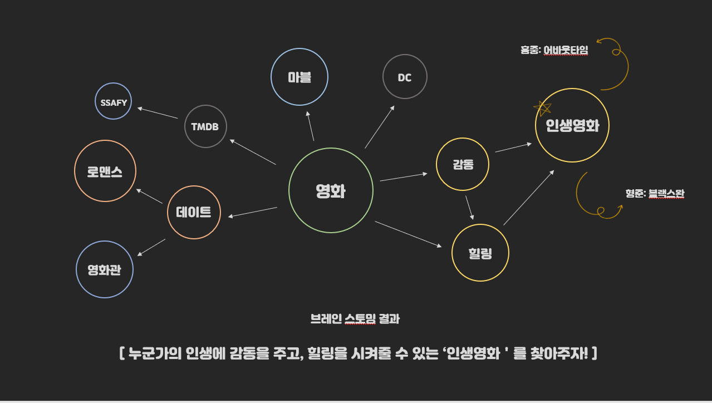

 

### 팀원

<table>
  <tr>
    <td align="center"><a href="https://github.com/hongjungkimm"> <b>HONGJUNG</b></a> </td>
    <td align="center"><a href="https://github.com/kimhyeongjun95"> <b>HYEONGJUN</b></a> </td>
  </tr>
</table>

 

### 주요 역할

- **HONGJUNG**: 📊 **Back-End**
- **HYEONGJUN**: 🎨 **Front-End**

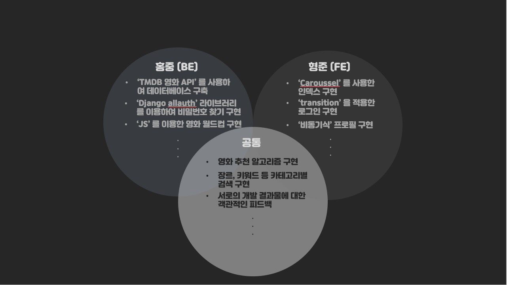

 

### What is Navie?

- **'Navie'** 는 **'Navigator**' 와 **'Movie'** 를 합친 서비스명으로써 사용자의 인생영화를 찾아주겠다는 의미를 내포하고 있습니다.

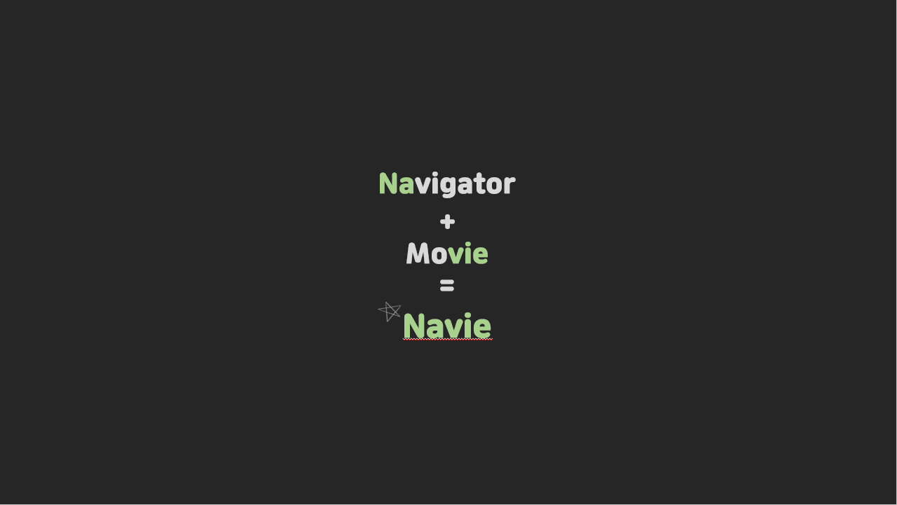

 

### 개발 규칙

- **협업**
  - **개발 일지**를 꾸준하게 작성하여, 서로의 개발 현황을 공유합니다.
  - 이슈가 발생하면, **즉시 공유하여 함께 해결**하기 위해 노력합니다.
  - **Git Commit message 규칙**을 지킵니다. ex) <날짜> <변경유형> [<변경사항>]
- **디자인**
  - **Look & Feel**, 사용자가 보고 느끼는 것을 최우선으로 생각합니다.
  - **일관된 디자인 컨셉**을 유지합니다.

 

## 프로젝트 디자인

### Tech Stack

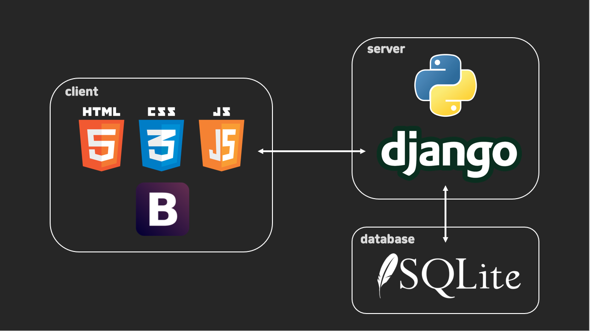

 

### Ui Design

- **기존 영화 사이트들의 UI를 참고**하였습니다.
- **Figma의 Community**에 있는 **여러 템플릿을 재가공하여 제작**하였습니다.

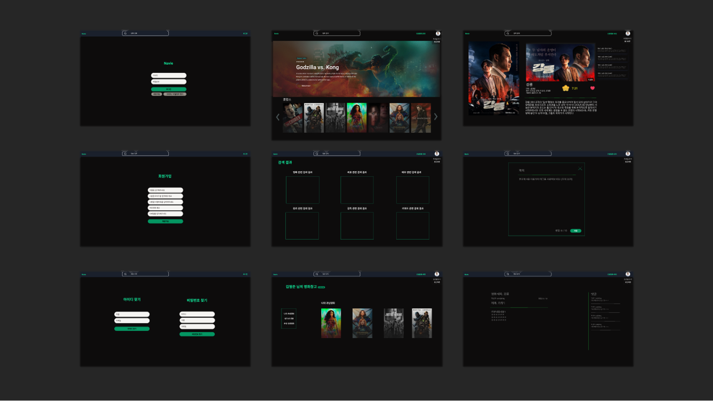

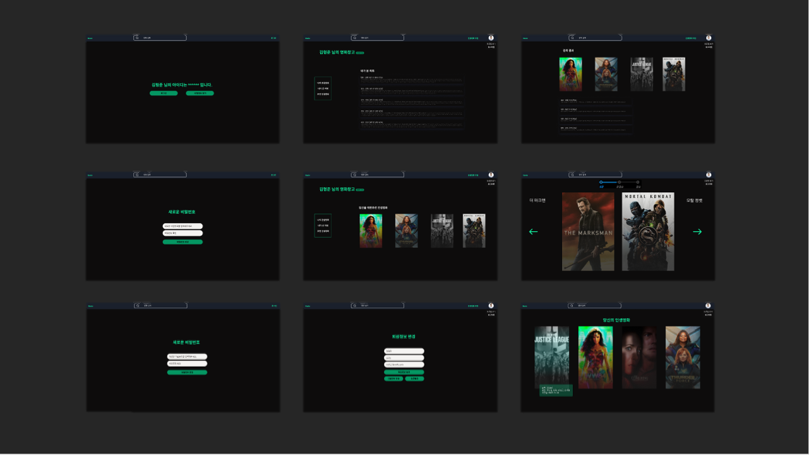

 

### ERD Design

- **ERD cloud**를 사용하여 제작하였습니다.
- **연계 테이블은 노란색으로 표시**하였습니다.
- 기능 구현을 하는 중에 필요한 필드나 테이블을 추가하면서 **지속적으로 수정**하였습니다.

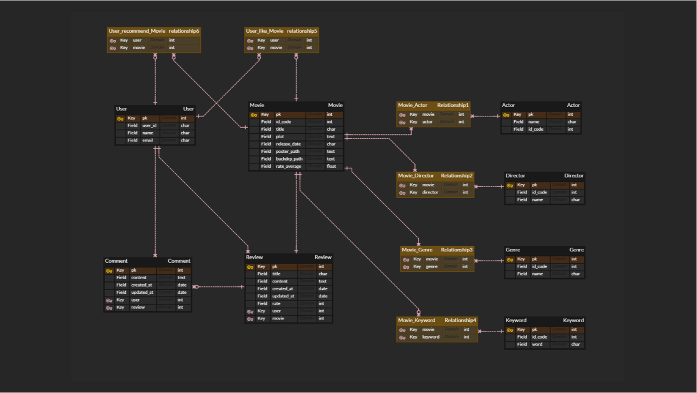

 

## 주요 기능

### 주요 기능 목록 및 설명

🎥 **회원가입 시연 영상** 🎥

- **회원가입**
  - 이름/아이디/비밀번호/비밀번호 확인/이메일을 입력하면 회원가입 되도록 구현하였습니다.
  - **기존 아이디와 중복, 비밀번호 불일치시에는 다시 입력하도록 구현**하였습니다.
  - **정보를 다 입력하지 않는다면 회원가입을 하지 못하도록 버튼을 비활성화**하였습니다.
  - **CSS 'transition' 을 적용하여 UI를 보강**하였습니다.

 

🎥 **로그인 & 로그아웃 시연 영상** 🎥

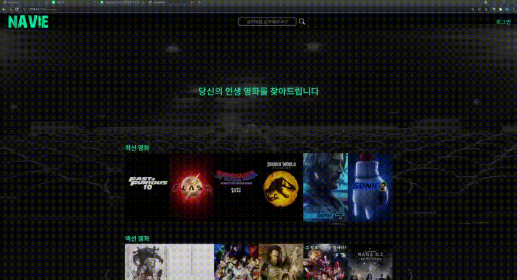

- **로그인 & 로그아웃**
  - **아이디와 비밀번호를 입력하지 않으면 로그인하지 못하도록 로그인 버튼을 비활성화**하였습니다.
  - 로그아웃은 버튼은 로그인한 회원만 보이도록 설정하였습니다.

 

🎥 **아이디 찾기 & 로그아웃 시연 영상** 🎥

- **아이디 찾기 & 비밀번호 찾기**
  - **아이디 찾기**는 가입한 이름과 이메일 일치하면 아이디를 알려주도록 구현하였습니다.
  - **비밀번호 찾기**는 **'all auth' 라이브러리를 이용**하여 사용자가 이메일 주소를 입력하면 그 이메일로 변경 url을 전송하도록 구현하였습니다.

 

🎥 **C R U D 시연 영상** 🎥

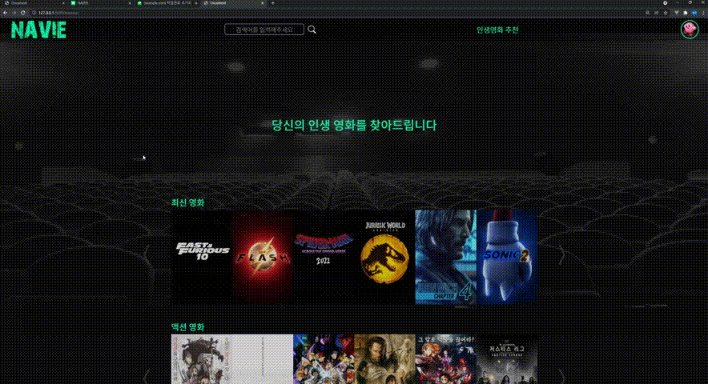

- **C R U D (영화 정보 조회, 영화 리뷰 작성/수정/삭제, 리뷰 댓글 작성/삭제)**
  - **TMDB Movie Video API를 통해 가져온 유튜브 영상 Key를 활용하여 영화 예고편을 음소거 자동재생하도록 구현**하였습니다.
  - **비동기식 처리를 통해 '좋아요' 기능을 구현**하였습니다.
  - 로그인한 회원만 리뷰나 댓글을 작성할 수 있으며, 해당 리뷰 혹은 댓글을 작성자만 수정/삭제할 수 있도록 구현하였습니다.

 

🎥 **회원정보 수정 시연 영상** 🎥

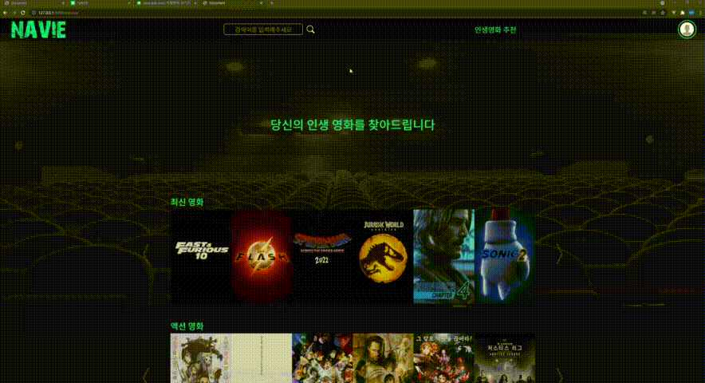

- **회원정보 수정**
  - 이름과 이메일만 변경 가능하도록 구현하였습니다.
  - **프로필 이미지를 설정할 수 있도록 구현**하였습니다.
  - 회원이 원하면 탈퇴를 할 수 있도록 구현하였습니다.

 

🎥 **검색 & 프로필 시연 영상** 🎥

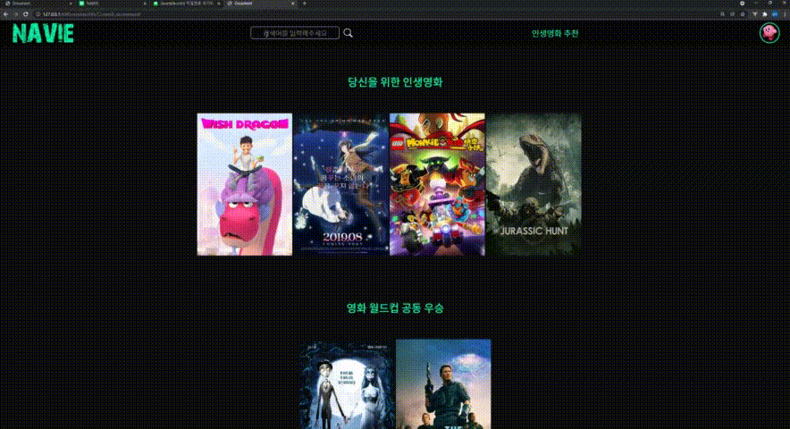

- **검색 & 프로필**
  - **검색**은 **영화, 리뷰, 장르, 배우, 키워드별 검색 결과를 조회 가능하도록 구현**하였습니다.
  - **프로필에서는 비동기식 처리를 통해 '나의 관심 영화', '내가 쓴 리뷰', 추천 인생영화' 를 조회할 수 있도록 구현**하였습니다.

 

🎥 **영화 월드컵을 통한 영화 추천 시연 영상** 🎥

- **영화 월드컵을 통한 영화 추천**
  - **TMDB에서 가져온 약 1000개의 영화 데이터를 통해 액션, 로맨스, 범죄, 공포, 코미디, SF, 가족, 음악 총 8개 장르의 대표 영화를 도출**하였습니다.
  - **각 장르의 대표 영화**는 **장르 별로 TMDB 평점이 높은 순 그리고 최신 순으로 정렬한 후 랜덤으로 지정**하였습니다.
  - 회원에게 각 장르의 대표 영화를 통한 **영화 월드컵을 진행하도로 구현**하였습니다.
  - 최종 결승까지 올라간 2개의 영화는 공동 우승 처리되며, 그 **2개의 영화 장르를 기반으로 총 4개의 영화를 회원에게 추천하도록 구현**하였습니다.
  - 회원이 인생영화 추천을 횟수 제한없이 받을 수 있도록 구현하였습니다.

